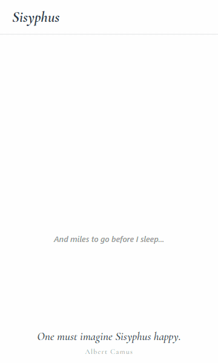
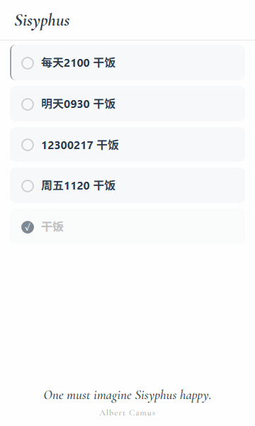

<p align="center">
  
</p>

<h1 align="center">Sisyphus</h1>

<p align="center">
  Chrome ツールバーに住む todo / check-in / reminder popup。<br>
  小さな用事を書き、時間まで預け、終わったら消す。戻るべきタスクは、次の周期に戻ってきます。
</p>

<p align="center">
  <a href="../../README.md">简体中文</a> ·
  <a href="README.en.md">English</a> ·
  <a href="README.ja.md">日本語</a> ·
  <a href="README.ko.md">한국어</a>
</p>

<p align="center">
  
  
  
  
</p>

---

## 性格

Sisyphus は、大きなタスク管理ツールを開くほどではないけれど、頭の中に置き続けるには少し重い用事のための拡張です。`明天0930 ごはんを食べる`、`每天2100 ごはんを食べる`、`周五1120 ごはんを食べる` のように、1 行で書けます。

Chrome popup として開くので、新しいタブに移動する必要はありません。popup を閉じても、reminder、snooze、repeat reset は Chrome alarms がバックグラウンドで扱います。

## ✨ 知っておきたい 3 つ

🧠 **1 行入れれば、構造化フィールドに**<br>
Quick Add が 1 行から日付、時刻、repeat、タスク名を取り出し、残りはタスク本文として残します。

🔔 **popup を閉じていても大丈夫**<br>
background alarm がスケジュールを続け、Chrome 通知が `Snooze` と `Done` を出します。窓を開かなくても打刻できます。

🔁 **repeat task は一度のチェックで終わりではない**<br>
daily / weekly / monthly は次の周期で active に戻ります。

## スクリーンショット

### デモ

**Quick Add：1 行から構造化フィールドへ**

<p align="center">
  
</p>

`明天0930 干饭` は実際の popup flow で作成されます。リストにはタスク名の `干饭` だけが残り、編集画面では解析された deadline と reminder time を確認できます。

**Global Reminder：24 時間形式を手入力**

<p align="center">
  
</p>

ベルのパネルは全体の daily reminder 設定です。オン/オフ、24 時間形式の既定時刻、Snooze 分数をここで扱います。

### 全体コンテキスト

<p align="center">
  
  <br>
  <sub>ブラウザ Popup</sub>
</p>

<p align="center">
  
  <br>
  <sub>Quick Add</sub>
</p>

<p align="center">
  
  <br>
  <sub>Chrome 通知 Snooze / Done</sub>
</p>

<details>
<summary>ノイズを抑えた詳細ショット（既定で隠れている操作）</summary>

#### デフォルトのメインリスト：ヘッダー操作は非表示

<p align="center">
  
</p>

#### ヘッダーの非表示 / 表示

<p align="center">
  
</p>

#### Quick Add フォーム

<p align="center">
  
</p>

#### 毎日のリマインダー設定

<p align="center">
  
</p>

#### 通知ボタン

<p align="center">
  
</p>

</details>

## 主な機能

すべての機能は下の表にまとまっています。普段は閉じておき、必要なときに開いて確認できます。

<details>
<summary>📋 全機能テーブルを開く</summary>

| 機能 | 説明 |
| --- | --- |
| Popup-first | 拡張アイコンから 360px の todo popup を直接開きます。 |
| Local-first | todos、reminders、title、quote、view state は `chrome.storage.local` に保存されます。 |
| アプリ名変更 | 左上の `Sisyphus` をダブルクリックして名前を変更できます。Enter/blur で保存、Esc でキャンセル、空なら既定名に戻ります。 |
| quote 変更 | footer quote は popup 下部に固定。ダブルクリックで quote と author を編集できます。 |
| 自然言語 Quick Add | `明天0930 ごはんを食べる`、`每天2100 ごはんを食べる`、`12300217 ごはんを食べる` を構造化 todo にします。 |
| 8 桁速記 | `MMDDHHMM title` で日付と時刻をまとめて書けます。 |
| 任意の Deadline | 作成・編集時に deadline を設定またはクリアできます。 |
| タスク別 Reminder | 各 todo に個別の reminder time を設定できます。空なら global time を使用。 |
| Reminder history | 直近 3 件の reminder time を残し、再利用しやすくします。 |
| Global reminder panel | ベルから daily reminder、手入力の 24 時間制 default time、Snooze minutes を設定。 |
| Snooze / Done | Chrome 通知から延期または完了できます。 |
| Re-remind | 5 / 10 / 15 / 30 分後の再通知に対応。 |
| Background scheduling | popup を閉じても reminders、snoozes、repeat resets は動き続けます。 |
| Repeat rollover | daily / weekly / monthly の todo は次の周期で active に戻ります。 |
| Repeat-only view | 目のボタンで repeat todo だけを表示し、その状態を記憶します。 |
| Pinning | ピン留めした todo を上に表示し、左の細線で示します。 |
| Quiet controls | header controls と row actions は hover/focus まで控えめに隠れます。 |
| Completed fade-out | 通常 todo は完了後およそ 60 秒でフェードアウトします。 |
| Overdue hint | 期限切れ todo は左側の静かな表示で示します。 |
| 自動テーマ | 18:00 から 06:00 は dark、それ以外は light。 |
| Shortcut | 推奨ショートカットは `Alt+Shift+S`。 |

</details>

## 自然言語 Quick Add

Quick Add は日常の todo 向けの軽量な自然言語パーサーです。メッセージを書くように 1 行で入力すると、Sisyphus が認識できる日付、時刻、repeat を構造化フィールドに変換し、残りのテキストをタスク名として残します。

8 桁の速記は `MMDDHHMM title` です。月、日、24 時間制の時、分、そしてタスク名という意味で、年は現在の年を使います。

```text
明天0930 ごはんを食べる
后天0600 ごはんを食べる
后天 0600 ごはんを食べる
每天2100 ごはんを食べる
周五1120 ごはんを食べる
0930 ごはんを食べる
12300217 ごはんを食べる
06041200 ごはんを食べる
ごはんを食べる
```

| 入力 | 解析結果 | タスク名 |
| --- | --- | --- |
| `明天0930 ごはんを食べる` | due date = tomorrow、reminder = 09:30 | `ごはんを食べる` |
| `后天0600 ごはんを食べる` | due date = day after tomorrow、reminder = 06:00 | `ごはんを食べる` |
| `后天 0600 ごはんを食べる` | due date = day after tomorrow、reminder = 06:00 | `ごはんを食べる` |
| `每天2100 ごはんを食べる` | repeat = daily、reminder = 21:00 | `ごはんを食べる` |
| `周五1120 ごはんを食べる` | due date = next Friday、reminder = 11:20 | `ごはんを食べる` |
| `0930 ごはんを食べる` | reminder = 09:30 | `ごはんを食べる` |
| `12300217 ごはんを食べる` | due date = 今年 12/30、reminder = 02:17 | `ごはんを食べる` |
| `06041200 ごはんを食べる` | due date = 今年 06/04、reminder = 12:00 | `ごはんを食べる` |
| `ごはんを食べる` | 日付や時刻を抽出せず、通常の todo として作成 | `ごはんを食べる` |

対応 token: `今天`, `明天`, `后天`, `周一` から `周日`, `星期一` から `星期日`, `每天`, `每周`, `每月`, `HHMM`, `HH:MM`, `MMDDHHMM title`。

## Repeat

| Repeat | 復帰動作 |
| --- | --- |
| Daily | 完了日の翌日に戻ります。 |
| Weekly | 完了日の 1 週間後に戻ります。 |
| Monthly | 完了日の 1 か月後に戻ります。 |

戻るときは古い `completedAt` と `snoozedUntil` を消し、due date があれば現在または次の周期に進めます。

## 操作

普段は覚えておく必要はありません。動作を確認したいときに開いてください。

<details>
<summary>🛠 詳しい操作手順を開く</summary>

| 操作 | 動作 |
| --- | --- |
| `+` をクリック | 追加フォームを開きます。 |
| 追加フォームで `Enter` | todo を作成します。 |
| IME 変換中に `Enter` | 誤送信しないよう保護されています。 |
| `后天0600 ごはんを食べる` | 明後日と 06:00 を解析し、残りをタスク名にします。 |
| `12300217 ごはんを食べる` | `MMDDHHMM title` として、今年 12/30 02:17 に解析します。 |
| Deadline の `x` | 日付をクリアします。 |
| Reminder に `0930` | `09:30` に正規化します。 |
| Global reminder settings に `0930` / `09:30` / `20:00` | ネイティブのドロップダウンを開かず、24 時間制の default time として保存します。 |
| Reminder history | 直近 3 件の reminder time を再利用できます。 |
| Re-remind を選ぶ | 未完了のままなら選んだ間隔で再通知します。 |
| todo の丸をクリック | 完了 / 未完了を切り替えます。 |
| todo テキストをクリック | その下に inline edit form を開きます。 |
| 編集フォームの外をクリック | 編集フォームを閉じます。 |
| todo を hover/focus | pin と delete を表示します。 |
| ベルをクリック | global reminder settings を開きます。 |
| 目をクリック | all / repeat-only view を切り替えます。 |

</details>

## 権限とプライバシー

| 権限 | 用途 |
| --- | --- |
| `storage` | todos、reminder settings、title、quote、view state の保存。 |
| `alarms` | popup が閉じていても reminders、snoozes、repeat resets をスケジュール。 |
| `notifications` | Chrome desktop reminders を表示。 |

Sisyphus はアカウントを必要とせず、バックエンドサービスにも analytics にも接続しません。

## インストール

1. このディレクトリをダウンロードまたは clone します。
2. `chrome://extensions/` を開きます。
3. Developer mode を有効にします。
4. Load unpacked をクリックします。
5. `todo-extension` フォルダを選択します。
6. 必要なら `chrome://extensions/shortcuts` でショートカットを変更します。推奨は `Alt+Shift+S` です。
