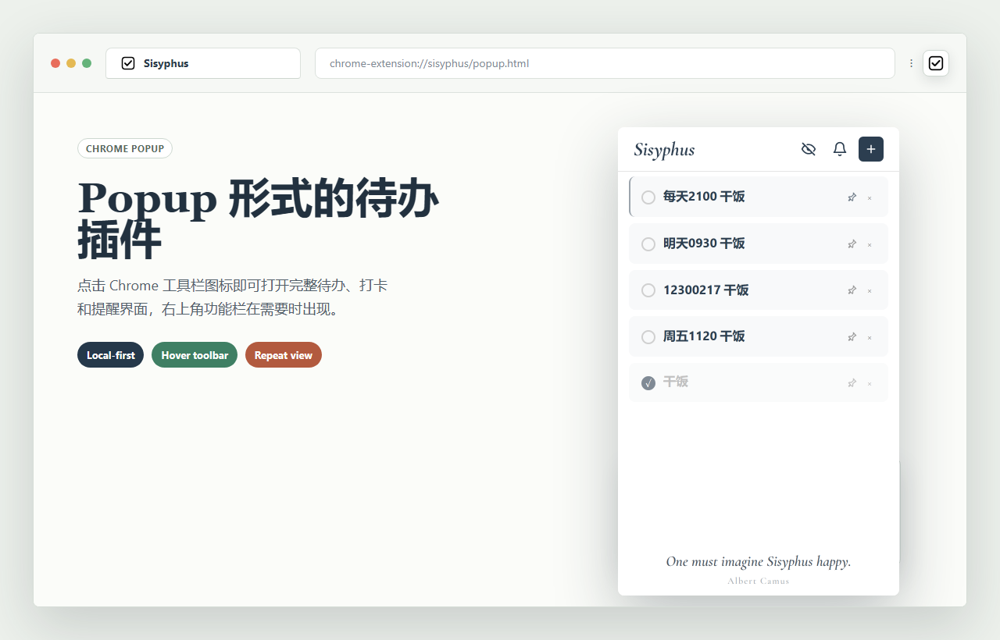
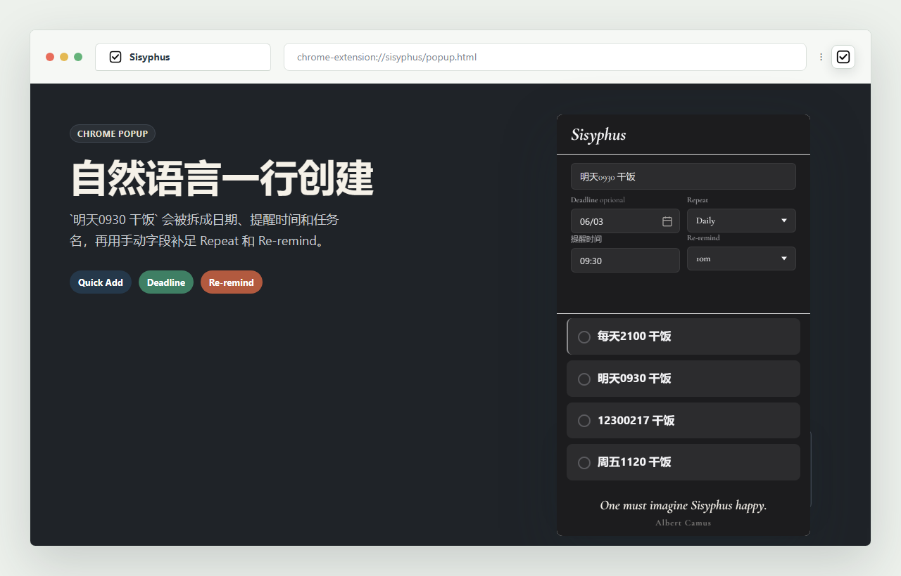
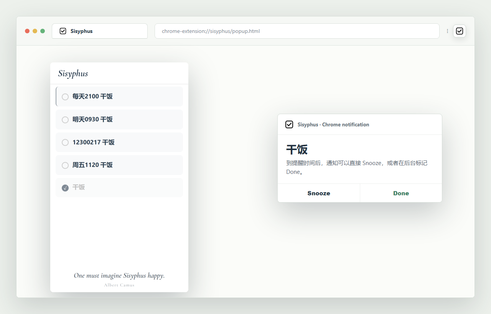
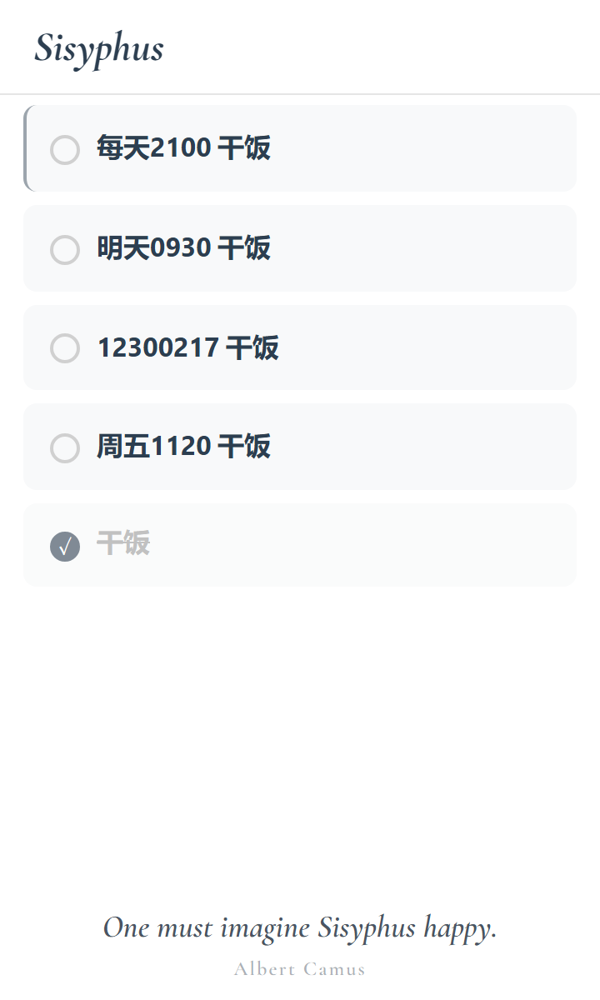
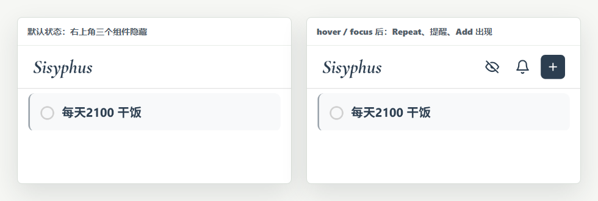
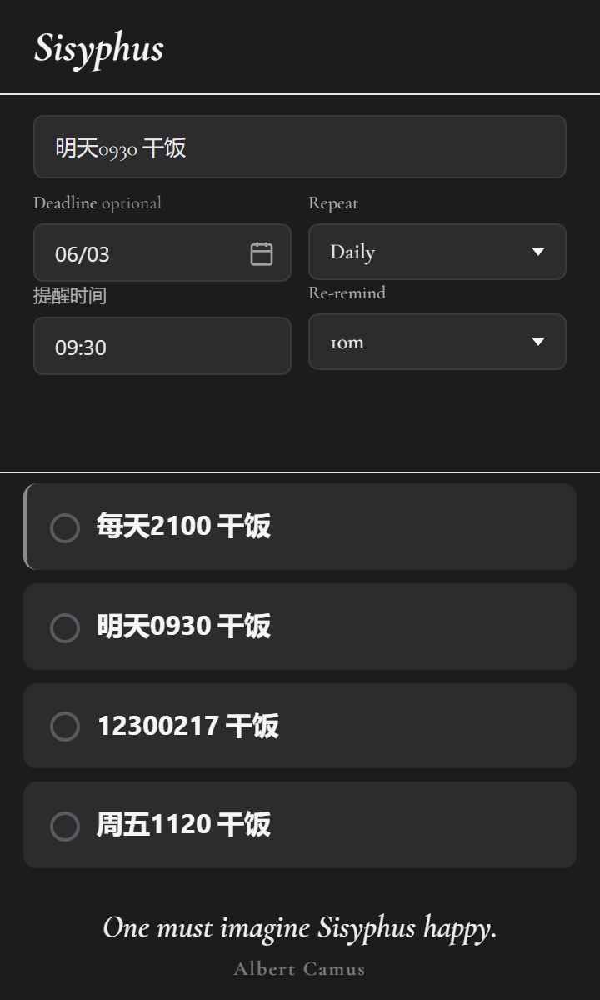
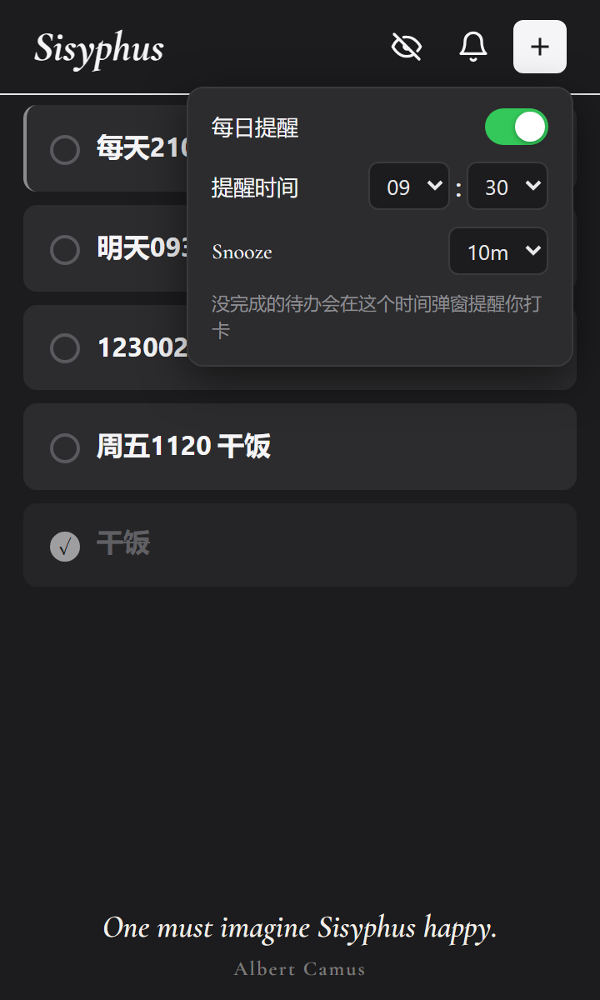
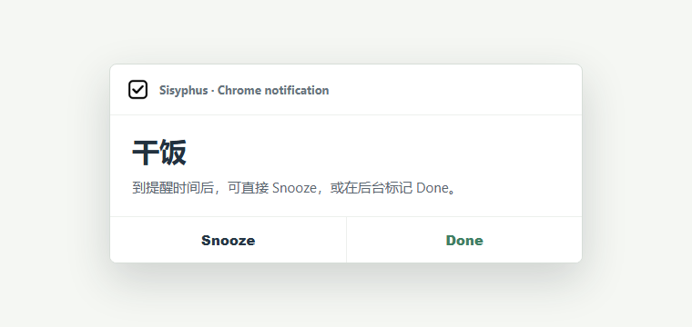

<p align="center">
  
</p>

<h1 align="center">Sisyphus</h1>

<p align="center">
  조용하고 안정적인 local-first Chrome todo / check-in / reminder 확장입니다.<br>
  매일 반복되는 작은 ritual, 짧은 알림, Snooze, Done, 그리고 실제로 다시 돌아오는 Repeat 를 위해 만들어졌습니다.
</p>

<p align="center">
  <a href="../../README.md">简体中文</a> ·
  <a href="README.en.md">English</a> ·
  <a href="README.ja.md">日本語</a> ·
  <a href="README.ko.md">한국어</a>
</p>

---

## Screenshots

### 전체 맥락

#### 브라우저 Popup



#### Quick Add



#### Chrome 알림 Snooze / Done



### 시각적 노이즈를 줄인 세부 화면

#### 기본 메인 목록: 헤더 컨트롤 숨김

<p align="center">
  
</p>

#### 헤더 숨김 / 표시 비교

<p align="center">
  
</p>

#### Quick Add 폼

<p align="center">
  
</p>

#### 일일 알림 패널

<p align="center">
  
</p>

#### 알림 버튼

<p align="center">
  
</p>

## 주요 기능

| 기능 | 설명 |
| --- | --- |
| Popup-first | 확장 아이콘을 누르면 todo 화면이 바로 열립니다. |
| Local-first | todos, reminders, title, quote, view state 는 `chrome.storage.local` 에 저장됩니다. |
| 앱 이름 변경 | 왼쪽 위 `Sisyphus` 를 더블 클릭해 이름을 바꿀 수 있습니다. Enter/blur 저장, Esc 취소, 빈 값은 기본 이름으로 돌아갑니다. |
| quote 변경 | footer quote 를 더블 클릭해 quote 와 author 를 수정할 수 있습니다. |
| 자연어 Quick Add | `明天0930 밥 먹기` 또는 `12300217 밥 먹기` 를 입력하면 날짜, reminder time, repeat, task title 을 자동으로 분리합니다. |
| 선택적 Deadline | 생성/수정 시 deadline 을 설정하거나 지울 수 있습니다. |
| 작업별 Reminder | 각 todo 가 고유한 reminder time 을 가질 수 있고, 비어 있으면 global time 을 사용합니다. |
| Global reminder panel | 종 버튼에서 daily reminder, default time, Snooze minutes 를 설정합니다. |
| Snooze / Done | Chrome 알림에서 미루기 또는 완료 처리를 할 수 있습니다. |
| Re-remind | 5 / 10 / 15 / 30 분 후 다시 알릴 수 있습니다. |
| Repeat rollover | daily / weekly / monthly todo 는 다음 주기에 active 상태로 돌아옵니다. |
| Repeat-only view | 눈 버튼으로 반복 todo 만 보고, 상태를 기억합니다. |
| Pinning | 고정한 todo 는 먼저 표시되고 왼쪽 가는 선으로 표시됩니다. |
| Quiet controls | pin, delete, bell, eye 는 hover/focus 전까지 조용하게 숨겨집니다. |
| Completed fade-out | 일반 todo 는 완료 후 약 60초 뒤 fade out 됩니다. |
| 자동 테마 | 18:00 부터 06:00 까지는 dark, 그 외 시간은 light. |

## 조작

| 조작 | 동작 |
| --- | --- |
| `+` 클릭 | 추가 폼을 엽니다. |
| 추가 폼에서 `Enter` | todo 를 생성합니다. |
| IME 조합 중 `Enter` | 조합 보호로 조기 제출되지 않습니다. |
| Deadline 의 `x` | 날짜를 지웁니다. |
| Reminder 에 `0930` 입력 | `09:30` 으로 정규화합니다. |
| Reminder history | 최근 3개의 reminder time 을 재사용합니다. |
| todo 원 클릭 | 완료 / 미완료를 전환합니다. |
| todo 텍스트 클릭 | 현재 항목 아래에 inline edit form 을 엽니다. |
| 편집 폼 밖 클릭 | 편집 폼을 접습니다. |
| todo hover/focus | pin 과 delete 를 표시합니다. |
| 종 클릭 | global reminder settings 를 엽니다. |
| 눈 클릭 | all / repeat-only view 를 전환합니다. |

## 자연어 Quick Add

Quick Add 는 일상 todo 를 위한 가벼운 자연어 파서입니다. 메시지를 쓰듯 한 줄로 입력하면 Sisyphus 가 인식 가능한 날짜, 시간, repeat 를 구조화된 필드로 바꾸고, 남은 텍스트를 task title 로 유지합니다.

8자리 shorthand 는 `MMDDHHMM title` 입니다. 월, 일, 24시간제 시, 분, 그리고 task title 을 뜻하며, 연도는 현재 연도를 사용합니다.

```text
明天0930 밥 먹기
后天0600 밥 먹기
后天 0600 밥 먹기
每天2100 밥 먹기
周五1120 밥 먹기
0930 밥 먹기
12300217 밥 먹기
06041200 밥 먹기
밥 먹기
```

| 입력 | 파싱 결과 | Task title |
| --- | --- | --- |
| `明天0930 밥 먹기` | due date = tomorrow, reminder = 09:30 | `밥 먹기` |
| `后天0600 밥 먹기` | due date = day after tomorrow, reminder = 06:00 | `밥 먹기` |
| `后天 0600 밥 먹기` | due date = day after tomorrow, reminder = 06:00 | `밥 먹기` |
| `每天2100 밥 먹기` | repeat = daily, reminder = 21:00 | `밥 먹기` |
| `周五1120 밥 먹기` | due date = next Friday, reminder = 11:20 | `밥 먹기` |
| `0930 밥 먹기` | reminder = 09:30 | `밥 먹기` |
| `12300217 밥 먹기` | due date = this year's 12/30, reminder = 02:17 | `밥 먹기` |
| `06041200 밥 먹기` | due date = this year's 06/04, reminder = 12:00 | `밥 먹기` |
| `밥 먹기` | 날짜나 알림을 추출하지 않는 plain todo | `밥 먹기` |

지원 token: `今天`, `明天`, `后天`, `周一` 부터 `周日`, `星期一` 부터 `星期日`, `每天`, `每周`, `每月`, `HHMM`, `HH:MM`, `MMDDHHMM title`.

## Repeat

| Repeat | 돌아오는 방식 |
| --- | --- |
| Daily | 완료 다음 날 돌아옵니다. |
| Weekly | 완료 1주 뒤 돌아옵니다. |
| Monthly | 완료 1개월 뒤 돌아옵니다. |

돌아올 때 이전 `completedAt` 과 `snoozedUntil` 을 지우고, due date 가 있으면 현재 또는 다음 주기로 이동합니다.

## 권한과 프라이버시

| 권한 | 용도 |
| --- | --- |
| `storage` | todos, reminder settings, title, quote, view state 저장. |
| `alarms` | popup 이 닫혀 있어도 reminders, snoozes, repeat resets 예약. |
| `notifications` | Chrome desktop reminders 표시. |

Sisyphus 는 계정이 필요 없고, 백엔드 서비스나 analytics 에 연결하지 않습니다.

## 설치

1. 이 디렉터리를 다운로드하거나 clone 합니다.
2. `chrome://extensions/` 를 엽니다.
3. Developer mode 를 켭니다.
4. Load unpacked 를 클릭합니다.
5. `todo-extension` 폴더를 선택합니다.
6. 필요하면 `chrome://extensions/shortcuts` 에서 단축키를 변경합니다. 기본 제안은 `Alt+Shift+S` 입니다.
